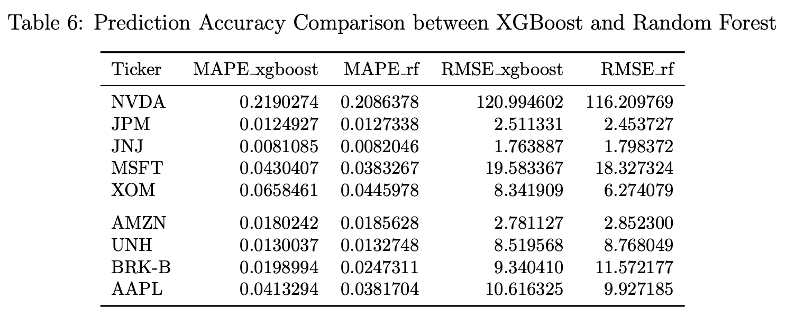
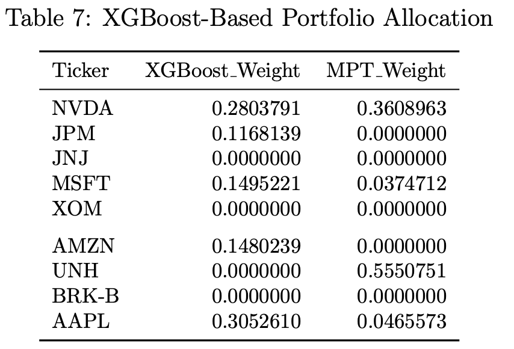
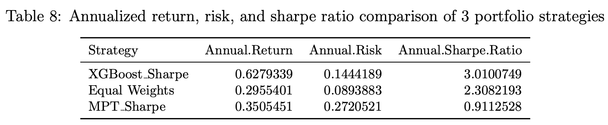
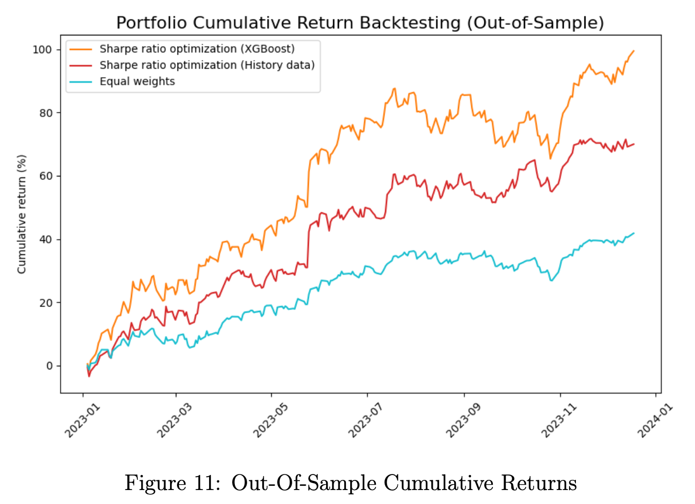

# Enhancing Mean-Variance Portfolio Optimization with Stock Price Prediction Using XGBoost

This project was completed as part of STAT495: Advanced Data Analysis at Amherst College in Fall 2023.
The goal of this course project was to create an expository review of a statistical method and demonstrate its simple application to a real-world dataset.
The report provides a detailed explanation of the mathematical underpinning of extreme gradient boosting (XGBoost) models and their application to stock price prediction and portfolio optimization.
This document showcases the results and implications of the application.

## Introduction

While the traditional mean-variance (MV) portfolio optimization has been widely used,
its dependence on historical returns and covariance estimates may lead to suboptimal performance.
This project aims to improve portfolio returns and risk management of the MV model by
determining the optimal weights of a portfolio based on stock price predictions using XGBoost models.

## Data

The study utilizes stock price data from 9 diverse stocks within the Standard & Poor 500 index, spanning various sectors.
The raw dataset includes daily Open, High, Low, Volume, Close (OHLCV) prices.
Our target variable is the daily Close price, and we derived 26 predictor variables, including 17 technical indicators, 2 lagged target variables, and 7 date-extracted features.
The XGBoost model was trained on 3 years of historical data, from January 28, 2019 to December 16, 2022,
and tested on a 1-year period, from December 19, 2023 to December 11, 2023.

## Stocks Used in the Portfolio

The analysis focused on the following stocks from the S&P 500, representing a range of sectors:

- **Technology**: Microsoft Corporation (MSFT), Apple Inc. (AAPL), NVIDIA Corporation (NVDA)
- **Consumer Cyclical**: Amazon.com Inc. (AMZN)
- **Healthcare**: UnitedHealth Group Incorporated (UNH), Johnson & Johnson (JNJ)
- **Financial Services**: Berkshire Hathaway Inc. (BRK-B), JPMorgan Chase & Co. (JPM)
- **Energy**: Exxon Mobil Corporation (XOM)

## Hyperparameter Tuning Framework

XGBoost is a boosting algorithm that has gained popularity due to its high predictive performance from ensembling weak learners and regularization techniques,
but its performance is highly dependent on hyperparameter tuning.
We employed Bayesian optimization methods with pruning strategies using the Optuna framework to efficiently search the hyperparameter space, achieving 3x speedup in optimization time compared to traditional grid search.
The objective was to minimize the root mean squared error (RMSE), and we utilized 5-fold cross-validation over 100 trials.

## Stock Price Prediction Performance (XGBoost vs Random Forest)

Observation: While boosting models are known for their superior predictive performance, they are also more sensitive to hyperparameter settings.
Even thought we fit random forest with hyperparameter tuning over narrow search space,
performance gap between the two models is marginal in this experiment.
XGBoost’s underperformance might stem from its sensitivity to hyperparameter settings.

## Asset Allocation

We utilized the XGBoost model to predict the next day's stock prices for the 9 stocks in our portfolio.
We then employed the predicted prices to determine the optimal weights of the assets based on Sharpe ratio maximization.
Below are the weights of the portfolio, as determined by our model:

## Portfolio Performance

We evaluted the performance of the XGBoost-based portfolio, the traditional MV model, and an equal weights strategy,
in a simulated environment with no transaction costs and no short selling (i.e. asset weights are positive).
We conducted backtesting over a 1-year period, from December 19, 2023 to December 11, 2023,
and compared the annual returns, risks, and Sharpe ratios of the portfolios.

## Conclusion

Integrating portfolio optimization with stock price prediction using a machine learning model has shown promising results,
outperforming the traditional portfolio optimziation method.
This analysis underscores the value of machine learning in quantitative financial strategies.
In future work, we would like to further explore the impact of constraints that are commonly imposed in real-world trading,
such as transaction costs, short-selling, and liquidity constraints,
on the performance of the XGBoost-based portfolio.
